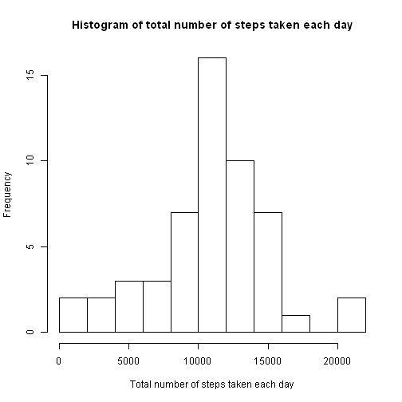
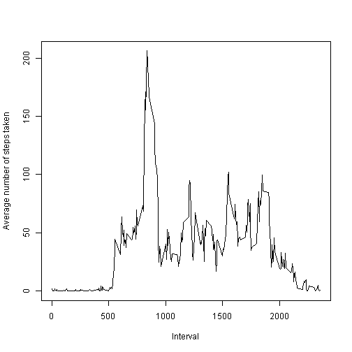
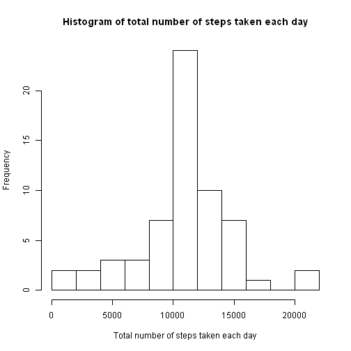
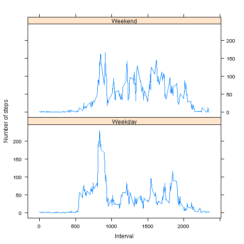

# Reproducible Research Peer Assessment 1

### Submitted by Hai Shang on 6/15/2014

## Loading and preprocessing the data


```r
setwd("D:\\My Documents\\Learning\\Coursera\\Reproducible Research\\Course Project 1\\RepData_PeerAssessment1")
if (!file.exists("activity.csv"))unzip("activity.zip")
data<-read.csv("activity.csv")
data$date<-as.Date(data$date,"%Y-%m-%d")
```

## What is mean total number of steps taken per day?

Histogram of the total number of steps taken each day

```r
data_nona<-data[!is.na(data$steps),]
s<-split(data_nona$steps,data_nona$date)
sumstepsbyday<-sapply(s,sum)
hist(sumstepsbyday,breaks=10,xlab='Total number of steps taken each day',main='Histogram of total number of steps taken each day')
```

 

Mean total number of steps taken per day

```r
mean(sumstepsbyday,na.rm=T)
```

```
## [1] 10766
```

Median total number of steps taken per day

```r
median(sumstepsbyday,na.rm=T)
```

```
## [1] 10765
```

## What is the average daily activity pattern?

Time series plot of the 5-minute interval and the average number of steps taken, averaged across all days


```r
factor_interval<-as.factor(data_nona$interval)
s<-split(data_nona$steps,factor_interval)
meanstepbyinterval<-sapply(s,mean)
plot(as.numeric(names(meanstepbyinterval)),meanstepbyinterval,type='l',xlab='Interval',ylab='Average number of steps taken')
```

 

Which 5-minute interval, on average across all the days in the dataset, contains the maximum number of steps?


```r
maxinterval<-which(meanstepbyinterval==max(meanstepbyinterval))
names(meanstepbyinterval)[maxinterval]
```

```
## [1] "835"
```

## Imputing missing values

Total number of missing values in the dataset


```r
sum(is.na(data$steps))
```

```
## [1] 2304
```

Impute each of the missing values with __the mean for the associated 5-minute interval__ calculated from observations with non-missing values.


```r
data_na<-data[is.na(data$steps),]
intervallist<-unique(data_na$interval)
for (i in 1:length(intervallist)) {
	data_na[data_na$interval==intervallist[i], "steps"]<-meanstepbyinterval[names(meanstepbyinterval)==as.character(intervallist[i])]
}
```

`data_new` is a new dataset that is equal to the original dataset but with the missing data filled in.

```r
data_new<-rbind(data_nona,data_na)
data_new<-data_new[order(data_new$date,data_new$interval),]
```

Histogram of the total number of steps taken each day (after imputing missing values)

```r
s<-split(data_new$steps,data_new$date)
sumstepsbyday_new<-sapply(s,sum)
hist(sumstepsbyday_new,breaks=10,xlab='Total number of steps taken each day',main='Histogram of total number of steps taken each day')
```

 

Mean total number of steps taken per day (after imputing missing values)

```r
mean(sumstepsbyday_new,na.rm=T)
```

```
## [1] 10766
```

Median total number of steps taken per day (after imputing missing values)

```r
median(sumstepsbyday_new,na.rm=T)
```

```
## [1] 10766
```

The mean value is the same as the estimate from the first part of the assignment.  The median value is only slightly changed.  Therefore, the impact of imputing missing data on the estimates of the total daily number of steps seems small.


## Are there differences in activity patterns between weekdays and weekends?

The factor variable `daytype` with two levels - "weekday" and "weekend" indicates whether a given date is a weekday or weekend day.


```r
weekday<-weekdays(data_new$date)
data_new$daytype<-"Weekday"
data_new[(weekday=="Saturday")|(weekday=="Sunday"),"daytype"]<-"Weekend"
```

Below is a panel plot containing a time series plot of the 5-minute interval and the average number of steps taken, averaged across all weekday days or weekend days.  The plot is generated using the lattice system.


```r
key<-interaction(data_new$interval,data_new$daytype)
keytable<-data.frame(key)
keytable<-unique(cbind(keytable,data_new$interval,data_new$daytype))
colnames(keytable)<-c("key","interval","daytype")

s<-split(data_new$steps,key)
meanstepbyinterval_new<-sapply(s,mean)

chartdata<-data.frame(meanstepbyinterval_new)
chartdata<-cbind(chartdata,names(meanstepbyinterval_new))
colnames(chartdata)<-c("averagestep","key")
chartdata<-merge(chartdata,keytable,by="key",sort=F)

library(lattice)
xyplot(averagestep~interval|daytype,data=chartdata,layout=c(1,2),type='l',xlab='Interval',ylab='Number of steps')
```

 

As shown in the plot above, there are some differences in activity patterns between weekdays and weekends.  For example:
* There are more activities during the intervals 500-1000 on weekdays than on weekends.
* Activities are more evenly distributed across different intervals on weekends than on weekdays.
